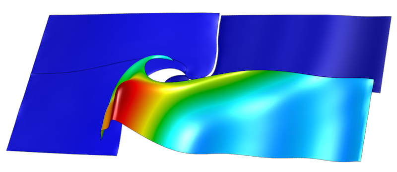
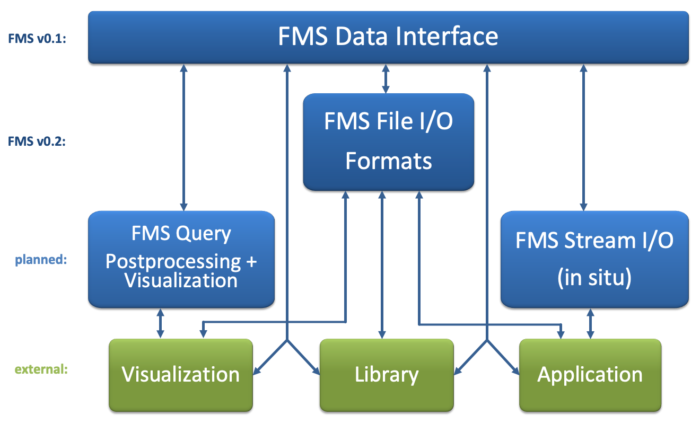

# FMS: CEED's high-order Field and Mesh Specification

[](https://opensource.org/licenses/BSD-2-Clause)
[](https://codedocs.xyz/CEED/FMS/)

## High-Order Data Description

This repository contains an initial high-order Field and Mesh Specification
(FMS) interface that allows a wide variety of applications and visualization
tools to represent unstructured high-order meshes with general high-order finite
element fields defined on them.

FMS is intended as a lightweight format and API that can represent general
finite elements within a common, easy to use framework. This includes high-order
solutions and meshes, as those depicted below, as well as non-standard finite
elements, such as Nedelec and Raviart-Thomas elements. See the [FMS
documentation](doc/fms.md) for more details.



The following diagram illustrates the current and planned components of FMS.



The repository is part of the [CEED software suite][ceed-soft], a collection of
software benchmarks, miniapps, libraries and APIs for efficient exascale
discretizations based on high-order finite element and spectral element methods.
See http://github.com/ceed for more information and source code availability.

The CEED research is supported by the [Exascale Computing Project][ecp]
(17-SC-20-SC), a collaborative effort of two U.S. Department of Energy
organizations (Office of Science and the National Nuclear Security
Administration) responsible for the planning and preparation of a [capable
exascale ecosystem](https://exascaleproject.org/what-is-exascale), including
software, applications, hardware, advanced system engineering and early testbed
platforms, in support of the nation’s exascale computing imperative.

For more details on the CEED FMS interface see http://ceed.exascaleproject.org/fms/.
We are interested in collaborating with application scientists and visualization
teams to further improve FMS and make it a viable option for high-order data
exchange and high-order visualization and data analysis.

## Building

Build a _static_ version of FMS with the default _Release_ configuration:
```console
mkdir build
cd build
cmake ..
make
```

Build and install a _shared_ version of FMS with _Debug_ configuration:
```console
mkdir build
cd build
cmake .. -DCMAKE_BUILD_TYPE=Debug -DBUILD_SHARED_LIBS=ON \
  -DCMAKE_INSTALL_PREFIX=../install
make
make install
```

## Contact

You can reach the CEED/FMS team by emailing [ceed-users@llnl.gov](mailto:ceed-users@llnl.gov)
or by leaving a comment in the [issue tracker](https://github.com/CEED/FMS/issues).

## Copyright

The following copyright applies to each file in the CEED software suite, unless
otherwise stated in the file:

> Copyright (c) 2017, Lawrence Livermore National Security, LLC. Produced at the
> Lawrence Livermore National Laboratory. LLNL-CODE-734707. All Rights reserved.

See files LICENSE and NOTICE for details.

[ceed-soft]:   http://ceed.exascaleproject.org/software/
[ecp]:         https://exascaleproject.org/exascale-computing-project
