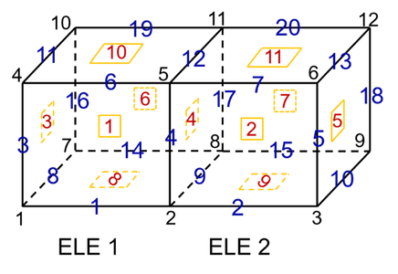
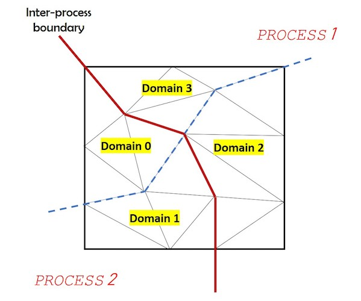

# FMS Documentation

This header provides a brief description of the FMS data format/API proposed by
the ECP/CEED co-design center to represent unstructured high-order meshes with
general high-order finite element fields defined on them.

Developers may also want to consult the automatically updated
[Doxygen documentation](https://codedocs.xyz/CEED/FMS).

## Simulation Data

The data described by FMS is a collection of:

1. Mesh *topology*
2. Set of *fields* defined on that topology

This separation of mesh geometry and topology is important in many applications
(e.g. those with moving meshes) and allows the FMS format to handle general
high-order meshes in a simple and uniform way.

Note that the geometry of the mesh, described by the coordinates of the
vertices, for linear meshes, or the coordinates of the nodes for high-order
meshes is specified itself as just another finite element field, called *nodes*
or *coordinates* (for example as vector field in an H1-space of appropriate
order).

## Mesh Topology

The mesh topology, described by the type `FmsMesh` below, is represented by the
following interconnected *mesh entities*:

   * 0d-entities = Vertices
   * 1d-entities = Edges
   * 2d-entities = Faces: Triangles and Quads
   * 3d-entities = Elements/Volumes/Regions: Tets, Hexes, Wedges and Pyramids

The topology does not include geometric or finite element information, but does
include relations between the entities and their orientation with respect to
reference configurations.

The topology can also be split into *domains* and *components* which form a
decomposition (e.g. for parallel computations), or select a subset of physical
interest, respectively.

In FMS, the Mesh topology is described by objects of type `FmsMesh`, which can
be constructed with `FmsMeshConstruct()` and deleted with `FmsMeshDestroy()`.

### Mesh Entities

FMS makes the following assumptions about the mesh:

1. **All entities of all dimensions are represented in the mesh domains**, i.e.
   we expect explicitly numbered elements, faces, edges and vertices.<br>
   &nbsp;<br>
   

2. **An entity is described in terms of its sides**, where a _side_ is a one
   dimension lower entity; in other words an element is described in terms of
   its faces, a face in terms of its edges and an edge in terms of its
   vertices.<br>
   &nbsp;<br>
   

The first assumption may seem unusual for finite element codes, but it naturally
describes the entities with which finite element degrees of freedom are
associated, making it easy to describe fields (finite element functions) below.

The second assumption provides a set of *downward adjacencies* which allows easy
reconstruction of relations like element-vertex, while providing flexibility for
algorithms that need to loop over faces and edges.

More specifically, a mesh entity is described by a tuple of its *side entity*
indices. For an entity of dimension `d`, its side entities are its boundary
entities of dimension `d-1`.

For `FMS_TRIANGLE` and `FMS_QUADRILATERAL`, the edges (sides), "abc"/"abcd" and
the vertices "012"/"0123" are ordered counterclockwise, as illustrated in the
following diagram:

```
        3--c--2       2
        |     |      / \
        d     b     c   b
        |     |    /     \
        0--a--1   0---a---1
```

For 3D entities, the ordering of the edges inside the faces should follow
the counterclockwise ordering when looking the face from outside. This
rule is followed by the choices given below.

For `FMS_TETRAHEDRON`, the faces (sides), "ABCD", the edges, "abcdef", and the
vertices, "0123" are ordered as follows:

```
           z=0         y=0         x=0       x+y+z=1
            2           3           3           3
           / \         / \         / \         / \
          b   c       d   e       f   d       e   f
         /  A  \     /  B  \     /  C  \     /  D  \
        1---a---0   0---a---1   2---c---0   1---b---2
```

For example, vertex "0" has coordinates `(x,y,z)=(0,0,0)`, vertex "1" has
coordinates `(1,0,0)`, etc.

For `FMS_HEXAHEDRON`, the faces (sides), "ABCDEF", the edges, "abcdefghijkl" and
the vertices, "01234567", are ordered as follows:

```
              7--g--6
             /|    /|
            / l   / k   z=0      z=1      y=0      y=1      x=0      x=1
           h  |  f  |   bottom   top      front    back     left     right
          /   3-/c--2   2--c--3  7--g--6  4--e--5  6--g--7  7--h--4  5--f--6
         /   / /   /    |     |  |     |  |     |  |     |  |     |  |     |
        4--e--5   /     b  A  d  h  B  f  i  C  j  k  D  l  l  E  i  j  F  k
        |  d  |  b      |     |  |     |  |     |  |     |  |     |  |     |
        i /   j /       1--a--0  4--e--5  0--a--1  2--c--3  3--d--0  1--b--2
        |/    |/
        0--a--1
```

For example, vertex "0" has coordinates `(x,y,z)=(0,0,0)`, vertex "6" has
coordinates `(1,1,1)`, etc.


### Mesh Domains

Mesh domains describe sets of interconnected mesh entities (0d, 1d, 2d and 3d).
All entities in the domain are enumerated locally.

Each mesh domain can be viewed as its own independent mesh, as it provides full
description of the entities inside it (the face of all volumes are described as
2-entities, the edges of all faces are described as 1-entities, etc.)

A typical example to keep in mind is parallel computations, where an MPI tasks
can contain one (or several) domains, which can be processed independently in
the interior. Connections between domains are described using shared entities.
Domains are assigned a string name and an integer id. Thus, a domain is
identified uniquely by the tuple: (name, id, partition-id) where the partition id
is the one assigned to the containing mesh. The following picture shows
a 2D mesh partitioned between two processes and then each process has two domains.



In FMS, domains are described using objects of type `FmsDomain` which can only
exist as part of an `FmsMesh`; they are created using the `FmsMeshAddDomain()`
function. To describe the mesh entities inside the domain, one uses the functions
`FmsDomainSetNumVertices()`, `FmsDomainSetNumEntities()`,
`FmsDomainAddEntities()`, etc.

### Mesh Components

Mesh components are regions of physical interest defined across the mesh
domains, such as materials, sections of the boundary, different parts in
fluid-structure interaction, etc. The subset of the component on each domain is
a set of entities, which is called a "part". Each part is described as a list of
*entity indices* which point to entities of the associated domain. All
entities in the component must have (i) the same dimension and (ii) specified
orientation (relative to the entity as described in its domain).

Note that different components can overlap and be of different dimensions.
Typically, the whole is represented by a special component of all elements
(3-entities) on all domains. This is the component, for example, on which the
mesh nodes will be defined (see below).

In order to facilitate the definition of fields on the component, the following
additional data can be stored in every part of the component: for all lower
dimensional entities that are boundary to the *main* entities of the part, define
an array that maps the local (to the part) indices to the domain-indices. These
arrays plus the main array (the one describing the highest dimensional entities
of the component) define local numberings of all entities inside each
part. These numberings will be used to define the ordering of the degrees of
freedom of a field. When the main entity array is NULL (indicating that all
entities in the domain are used) then the lower dimensional entities will also be
NULL because there is no need to have local numbering of the entities - the
original numbering defined by the domain can be reused.

In addition to the parts, a component also stores relations to other
components. A relation to a component of lower or higher dimension indicates a
boundary or interface relation, i.e. the lower dimensional component describes a
subset of the boundary entities of the higher dimensional component. A relation
to another component of the same dimension is acceptable but has no specified
meaning.

A component has an associated *coordinates* or *nodes* field, of type
`FmsField`, which may be `NULL`.  Mesh *tags* (discussed below) are defined on
the set of all *main* entities in a mesh component.

Discrete fields are defined on mesh components. Unlike tags, discrete fields
generally associate data not only with the entities described by the mesh
component but also with the lower-dimensional boundary entities of the main
component entities.

In FMS, components are described using objects of type `FmsComponent` which only
exist as part of an `FmsMesh` and are created using the `FmsMeshAddComponent()`
function.  Parts and their entities can be added to the component with the
functions `FmsComponentAddPart()`, `FmsComponentAddPartEntities()`,
`FmsComponentAddRelation`, etc.

### Mesh Tags

A mesh *tag* is an array of integers describing the main entities in a given
component. Optionally, the integer tags can be assigned string descriptions.

Tags could be used to mark different boundary conditions, different materials in
the mesh, store the orders (polynomial degrees) associated with the component
entities in variable-order discrete spaces, etc.

Each tag naturally defines a non-overlapping decomposition of the associated
component. The array with the integer tags is ordered part-by-part within the
mesh component.

In FMS, tags are described using objects of type `FmsTag` which exist only as a
part of a mesh and can be created using the `FmsMeshAddTag()` function and
described by the functions `FmsTagSetComponent()`, `FmsTagSet`,
`FmsTagAddDescriptions`, etc.

## Fields

The fields, described by the type `FmsField` below, are high-order finite
element functions given in terms of their degrees of freedom associated with the
interior of each of the mesh entities. These fields can be specified only on mesh
components, and can describe any scalar or vector function in the de Rham complex
(H1, H(curl), H(div) and L2 elements).

As noted above, the coordinates of the mesh nodes, specifying the actual mesh
shape in physical space, are just a special field on the whole mesh.

In FMS each field is specified by defining a `FmsFieldDescriptor` that contains
the associated mesh component, the basis type describing the field and type of
the field itself i.e. continuous, discontinuous etc. Two options are available
for storing vector field data, either by dimension, `FMS_BY_VDIM` or by nodes
`FMS_BY_NODES`.  In the former, the pair of indices `(i,j)` of degree of freedom
`i` and vector component `j` are mapped to a 1D array by the formula
`i*vdim+j`; in latter choice (`FMS_BY_NODES`), the indices `(i,j)` are mapped
using the formula `i+num_dofs*j`.

FMS fields and their descriptors are stored in, and only exist as part of,
objects of type `FmsDataCollection` which in turn can be created on top of an
`FmsMesh` object using the function `FmsDataCollectionCreate`. Objects of types
`FmsField` and `FmsFieldDescriptor` can be created with the functions
`FmsDataCollectionAddFieldDescriptor` and `FmsDataCollectionAddField`.

## Example

Below is a complete example of using the FMS interface to describe a simple
mesh.

```c
// Example of using the FMS interface to describe the following 1-element mesh
//
//  <3>----(2)----<2>
//   |             |
//   |             |
//  (3)    [0]    (1)
//   |             |
//   |             |
//  <0>----(0)----<1>
//
// where <V> = vertex id, (E) = edge id and [Q] = quadrilateral id. The edge and
// element orientation are counter-clockwise:
//
// (0) = <0>,<1> ; (1) = <1>,<2> ; (2) = <2>,<3> ; (3) = <3>,<0>
// [0] = (0), (1), (2), (3)
//
// The mesh has one domain and two components: a volume containing element [0]
// and boundary containing edge (2). The volume component is tagged with the
// "material" tag.

#include <fms.h>

int main(int argc, const char *argv[]) {

  // Create the Mesh object
  FmsMesh mesh;
  FmsMeshConstruct(&mesh);
  // FmsMeshSetPartitionId(mesh, 0);

  // Mesh Domains
  FmsDomain *domain;
  FmsMeshAddDomains(mesh, "domains", 1, &domain);

  FmsDomainSetNumVertices(domain[0], 4);
  FmsDomainSetNumEntities(domain[0], FMS_EDGE, FMS_INT32, 4);
  FmsDomainSetNumEntities(domain[0], FMS_QUADRILATERAL, FMS_INT32, 1);

  // Edges
  const int edge_vert[] = {0,1, 1,2, 2,3, 3,0};
  FmsDomainAddEntities(domain[0], FMS_EDGE, NULL, FMS_INT32, edge_vert, 4);

  // Faces
  const int quad_edge[] = {0, 1, 2, 3};
  FmsDomainAddEntities(domain[0], FMS_QUADRILATERAL, NULL,
                       FMS_INT32, quad_edge, 1);

  // Mesh Components
  FmsComponent volume;
  FmsMeshAddComponent(mesh, "volume", &volume);
  FmsComponentAddDomain(volume, domain[0]);

  FmsComponent boundary;
  FmsMeshAddComponent(mesh, "boundary", &boundary);
  FmsInt part_id;
  FmsComponentAddPart(boundary, domain[0], &part_id);
  const int bdr_edge[] = {2};
  FmsComponentAddPartEntities(boundary, part_id, FMS_EDGE, FMS_INT32,
                              FMS_INT32, FMS_INT32, NULL, bdr_edge, NULL, 1);

  FmsComponentAddRelation(volume, 1); // 1 = index of "boundary" component

  // Mesh Tags
  FmsTag material;
  FmsMeshAddTag(mesh, "material", &material);
  FmsTagSetComponent(material, volume);
  const int material_tags[] = {1};
  FmsTagSet(material, FMS_INT32, FMS_INT32, material_tags, 1);

  // Finalize the construction of the Mesh object
  FmsMeshFinalize(mesh);
  // Perform some consistency checks.
  FmsMeshValidate(mesh);

  // Coordinates Field
  // Defdine data collection
  FmsDataCollection dc;
  FmsDataCollectionCreate(mesh, "data collection", &dc);

  // Define field descriptor
  FmsFieldDescriptor coords_fd;
  FmsDataCollectionAddFieldDescriptor(dc, "coords descriptor", &coords_fd);
  FmsFieldDescriptorSetComponent(coords_fd, volume);
  FmsInt coords_order = 1;
  FmsFieldDescriptorSetFixedOrder(coords_fd, FMS_CONTINUOUS,
                                  FMS_NODAL_GAUSS_CLOSED, coords_order);

  // Define the coordinates field
  FmsField coords;
  FmsDataCollectionAddField(dc, "coords", &coords);
  const double coords_data[] = {
    0.,0.,
    1.,0.,
    1.,1.,
    0.,1.
  };
  FmsInt sdim = 2; // A 2D mesh embedded in "sdim"-dimensional space.
  FmsFieldSet(coords, coords_fd, sdim, FMS_BY_VDIM, FMS_DOUBLE, coords_data);

  FmsComponentSetCoordinates(volume, coords);

  // Use the mesh to perform computations

  // Destroy the data collection: destroys the FmsMesh and all other linked Fms
  // objects.
  FmsDataCollectionDestroy(&dc);

  return 0;
}
```
